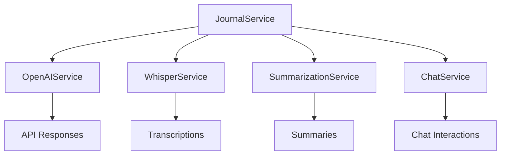

# Developer Documentation - AI Journaling Assistant Plugin

## Quick Start

### 1. Project Setup

```bash
git clone [repository-url]
cd obsidian-ai-journaling-assistant
npm install
```

### 2. Environment Setup

Create a `.env` file in the root directory:

```env
OPENAI_API_KEY=your_api_key_here
```

### 3. Development Build

```bash
npm run dev
```

## Architecture Overview

### Core Services

1. **JournalService** (`src/core/journal/JournalService.ts`)

   - Central service managing journal operations
   - Coordinates between other services
   - Handles journal creation, AI interactions, and content management

2. **OpenAIService** (`src/core/ai/services/OpenAIService.ts`)

   - Manages OpenAI API interactions
   - Handles streaming responses
   - Error handling for API calls

3. **WhisperService** (`src/core/ai/services/WhisperService.ts`)

   - Audio transcription functionality
   - Supports multiple audio formats
   - Handles file validation
   - Uses AudioProcessingService for format conversion
   - Manages Whisper API interactions

4. **AudioProcessingService** (`src/core/transcription/AudioProcessingService.ts`)

   - Handles audio format conversion (m4a to WAV)
   - Uses Web Audio API (available in Obsidian's Electron environment) to:
     - Decode m4a audio data
     - Process audio buffers
     - Create WAV format without external dependencies
   - Manages audio buffer processing
   - WAV file creation and header management

5. **TranscriptionService** (`src/core/transcription/TranscriptionService.ts`)
   - Manages the transcription workflow
   - Handles multiple recordings in a note
   - Uses WhisperService for transcription
   - Manages note content updates

### Data Flow



## Key Components

### 1. Journal Entry Management

```typescript
// Example: Creating a new journal entry
async openTodaysJournal(): Promise<void> {
    await this.journalManager.ensureFolder(this.settings.journalFolder);
    const filePath = `${this.settings.journalFolder}/${this.journalManager.getTodayFileName()}`;
    // ... rest of implementation
}
```

### 2. AI Integration

```typescript
// Example: Making an OpenAI request
async makeOpenAIRequest(prompt: string, onChunk?: (chunk: string) => void): Promise<string> {
    // ... implementation details
}
```

### 3. Audio Transcription

```typescript
// Example: Transcribing audio
async transcribeFile(audioFile: TFile): Promise<string> {
    // ... implementation details
}
```

## File Structure Explained

```bash
src/
├── core/                     # Core functionality
│   ├── ai/                  # AI-related services
│   │   ├── prompts/        # AI prompt templates
│   │   │   ├── en/        # English prompts
│   │   │   └── pl/        # Polish prompts
│   │   └── services/       # AI service implementations (OpenAI, Whisper)
│   ├── journal/            # Journal management
│   ├── summary/            # Summarization services
│   └── transcription/      # Audio transcription & processing
├── interfaces/              # TypeScript interfaces
├── settings/               # Plugin settings
├── types.ts                # TypeScript types
└── utils/                  # Helper functions
```

## Common Development Tasks

### 1. Adding a New AI Prompt

There are two ways to add prompts:

#### Default Language Prompts

1. Create new prompt file in `src/core/ai/prompts/[language]/`
2. Add the prompt to the corresponding language folder (en/pl)
3. Update PromptService's defaultPrompts object
4. Add any necessary interface updates

#### Custom User Prompts

Users can provide their own prompts through:

1. Creating markdown files in their vault
2. Configuring paths in plugin settings
3. The plugin validates file existence before using

### 2. Extending Settings

1. Update `JournalingAssistantSettings` interface in `src/types.ts`
2. Add new setting to `DEFAULT_SETTINGS`
3. Update `SettingTab.ts` to include new setting UI

### 3. Adding New Service

1. Create new service class in appropriate directory
2. Add interface in `src/interfaces/index.ts`
3. Update `JournalService` to use new service
4. Add service initialization in `main.ts`

### 4. Adding New Audio Format Support

1. Update `AudioProcessingService` with new conversion method
2. Add MIME type mapping in `WhisperService`
3. Update supported formats list
4. Add error handling for new format
5. Test with sample audio files

### 5. Adding New Language Support

1. Create new language folder in `src/core/ai/prompts/[language]/`
2. Add translated versions of all prompts:
   - chatPrompt.ts
   - journalPrompt.ts
   - summaryPrompt.ts
3. Update PromptService's defaultPrompts object
4. Add language option to settings
5. Update types.ts with new language code
